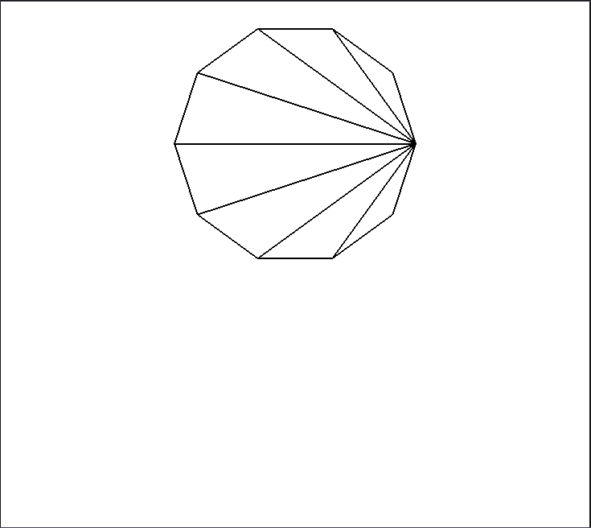
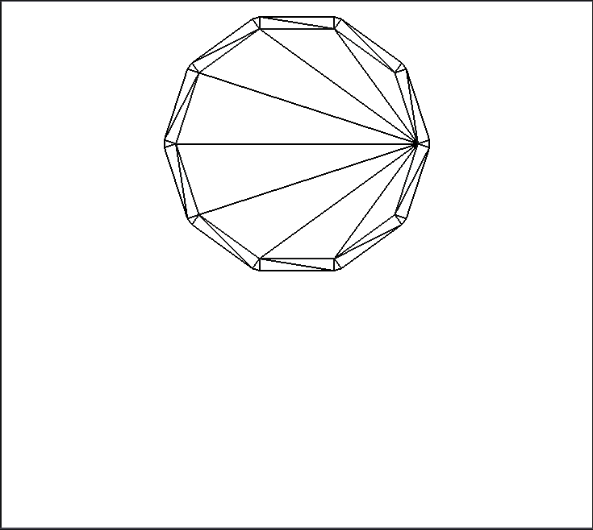
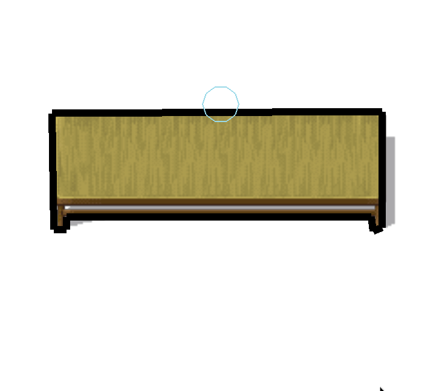

.　　关于2D地图擦除算法，去年我写过一个实现，勉强实现了地形擦除，但跟最终效果还相差甚远，这次我写了一个完整的实现，在此记录，留个印象。

.　　去年的版本[<<算法 & 数据结构——裁剪多边形>>](https://www.jianshu.com/p/bb0e84809ac8)，因为受限于当时框架用GDI实现的渲染器，只有擦除地形没有擦除地图，这次换了OpenGL渲染器，终于可以实现最终效果了。

这个算法看似简单，实际上就是很简单，大致可分为三个部分。

地图擦除：擦除地图的图像，产生视觉效果。

地形擦除：擦除地图的形状，用于物理计算。

橡皮擦：用于定义擦除的形状。

### 地图擦除

假设这是一副画在纸上的彩笔画，如果要擦除画上的一部分，有过生活经验的人立马就能想到用橡皮擦就好了，很多算法灵感来自生活，生活多姿多彩的人适合做程序员。这个实现过程大概就是：绑定地图到当前渲染目标，渲染“橡皮擦”让其覆盖范围内的像素，从而达到擦除效果。

### 橡皮擦
接着上一个环节，“橡皮擦”可以是从文件读取的一张图，也可以是程序生成的一张图。如果从文件读取，设置合适的BlendFunc，直接渲染覆盖像素颜色就行了，本例使用程序生成的图，因为这个灵活度更高。

这是一个正10边形的“橡皮擦”，从图中可看出，里面有几条线，把正10边形分割成了8个三角形，这8把三角形的面积和形状等于这个正10边形，如果你困惑为什么要切成三角形，你运气很好，有一个大佬刚好懂你的困惑，并为你量身定做了一篇答案[<<算法 & 数据结构——任意多边形填充>>](https://www.cnblogs.com/mmc1206x/p/11058795.html)。

以上则是地图的擦除效果，其中有一处细节，擦除的边缘有点生硬，如果要制作类似《弹弹堂》这样的游戏，地图是通过炮弹炸掉的，那么被擦除的边缘应该留下被炸过的痕迹，不用做的太真实，只要让边缘产生一些不一样的渐变色就行了，要实现这一点，只需扩展一下“橡皮擦”的边缘。

柔滑边缘，用于生成描边。

拆分三角网格，用于渲染。

柔滑边缘后的擦除效果。

### 地形擦除

以上是一张加了地形的图，你没有看错，就只是多了一个黑边。

现在要通过“橡皮擦”擦除这个黑边，与地图擦除不同的是，地图擦除是覆盖像素，而地形则是几何计算。

算法：

1. 从“橡皮擦”与地形相交部分计算出N条切线。

2. 取第i（0 <= i < N）条切线将地形一分为二。

3. 丢弃完全包含在“橡皮擦”内的地形。

4. i + 1，返回 2。

5. 当前地形被切分完毕，如果还有下一个地形则返回 1，否则结束。

**最终效果**

